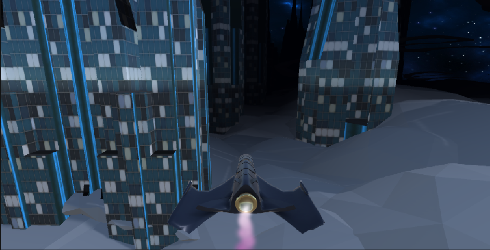
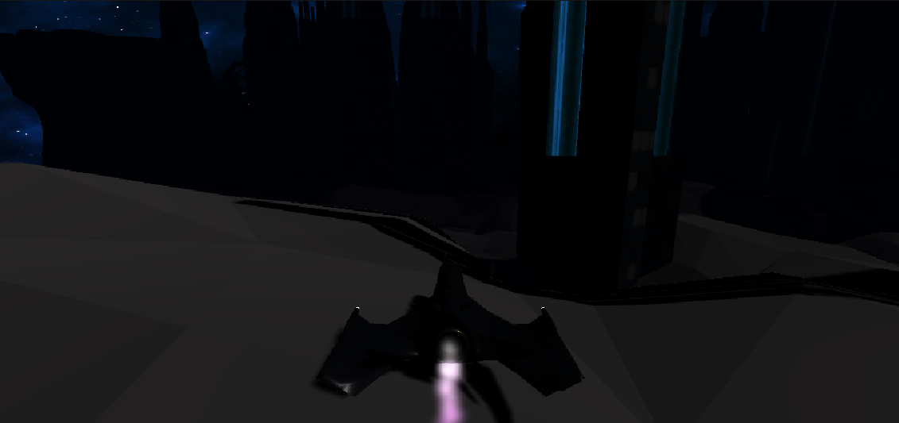

# Space Traveller - An Endless Runner Prototype

## Playable on Itch.io!

  

Welcome to the repository for **Space Traveller**, a 3D endless runner where the player pilots a futuristic spaceship through a treacherous, obstacle-filled cityscape. This project was a solo endeavor to build and refine the core mechanics of an infinite runner, focusing on responsive player controls and challenging level generation.

---

### 🖼️ In-Game Screenshots

| Navigating the Cityscape | In different difficulty |
| :---: | :---: |
|  |  |

---

### ✨ Key Implemented Features

* **Responsive Spaceship Controls:** Direct control over the spaceship's movement to navigate tight spaces and avoid collisions.
* **Procedural Obstacle Spawning:** Obstacles are generated endlessly, ensuring every run is a unique challenge.
* **Collision System:** A robust collision detection system to handle interactions between the player's ship and the environment.
* **Sci-Fi Aesthetics:** A futuristic theme with cityscape models and a spaceship protagonist.

---

### Project Status

**This project is a functional prototype.** The core gameplay loop—controlling the ship and dodging endlessly spawning obstacles—is fully implemented and playable on `itch.io`. While additional features like a high-score system were planned, the primary goal of creating a stable and engaging endless runner mechanic was successfully achieved.

---

### 💻 Technical Implementation

As the sole developer, I handled all programming and implementation in C#:

* **Player Controller:** Wrote the C# script that governs the spaceship's movement and responsiveness to player input.
* **Obstacle Spawner:** Created the system responsible for procedurally spawning and placing obstacles in the player's path.
* **Game Manager:** Set up the basic game state logic.

---

### 🔧 Tech Stack

* **Game Engine:** Unity
* **Language:** C#
* **Platform:** [itch.io](https://sspeed.itch.io/space-traveller)

---

*A Note on Assets:* To focus on programming and core mechanics, all 3D models and visual assets used in this project were sourced from the Unity Asset Store.
